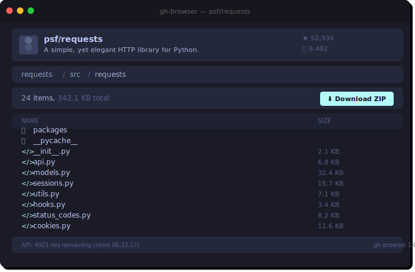

# gh-browser

> Browse GitHub repositories: file sizes, content previews, downloads — all in one clean interface.



## Features

- **File sizes** — see how big every file is at a glance
- **Content preview** — view text files with syntax highlighting right in the browser
- **Download files** — download any file with one click
- **Download folders** — download entire directories as ZIP archives (built client-side with JSZip)
- **Recent repos** — quick access to previously browsed repositories
- **GitHub API aware** — shows rate limit status, supports authentication tokens

## Usage

```
https://neocrev.github.io/gh-browser/?repo=owner/repo
```

Or just enter `owner/repo` in the input field.

## How it works

gh-browser uses the [GitHub REST API](https://docs.github.com/en/rest) to fetch repository contents, file metadata, and raw file content. Folder downloads are built client-side using JSZip — no server required.

## License

This project has a custom license. See [LICENSE](LICENSE) for details.
